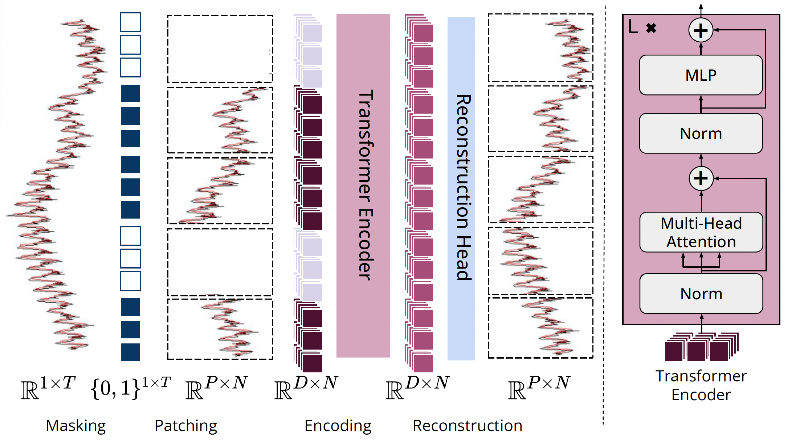

<div align="center">

<h1>MOMENT: A Family of Open Time-series Foundation Models</h1>

[](https://arxiv.org/abs/2402.03885)
[](https://huggingface.co/AutonLab/MOMENT-1-large)
[](https://huggingface.co/datasets/AutonLab/Timeseries-PILE)
[](https://opensource.org/license/MIT)
[]()

</div>

## 🔥 News
- Interested in LLM Agents for (Time Series) Machine Learning Engineering? Check out our latest work [TimeSeriesGym: A Scalable Benchmark for Time Series Machine Learning Engineering Agents](https://github.com/moment-timeseries-foundation-model/TimeSeriesGym)
- We just released the [small](https://huggingface.co/AutonLab/MOMENT-1-small) and [base](https://huggingface.co/AutonLab/MOMENT-1-base) versions of the MOMENT model. 
- 🔥🔥🔥 We released [MOMENT research](https://github.com/moment-timeseries-foundation-model/moment-research) code, so you can pre-train your own time series foundation model, with your own data, and reproduce experiments from [our paper](https://arxiv.org/abs/2402.03885)!
- We fixed an issue with Classification where MOMENT was unable to handle multi-channel inputs. 
- MOMENT was accepted at ICML 2024!
- Interested in multimodal time series & text foundation models? Check out our preliminary work on JoLT (**Jo**intly **L**earned Represenations for **T**ime series & **T**ext) [[AAAI 2024 Student Abstract](https://ojs.aaai.org/index.php/AAAI/article/view/30423), [NeurIPS 2023 DGM4H Workshop](https://openreview.net/forum?id=UVF1AMBj9u)]. JoLT won the best student abstract presentation at AAAI! Stay tuned for multimodal time series & text foundation models!

## 📖 Introduction
We introduce MOMENT, a family of open-source foundation models for general-purpose time-series analysis. Pre-training large models on time-series data is challenging due to (1) the absence a large and cohesive public time-series repository, and (2) diverse time-series characteristics which make multi-dataset training onerous. Additionally, (3) experimental benchmarks to evaluate these models especially in scenarios with limited resources, time, and supervision, are still in its nascent stages. To address these challenges, we compile a large and diverse collection of public time-series, called the Time-series Pile, and systematically tackle time-series-specific challenges to unlock large-scale multi-dataset pre-training. Finally, we build on recent work to design a benchmark to evaluate time-series foundation models on diverse tasks and datasets in limited supervision settings. Experiments on this benchmark demonstrate the effectiveness of our pre-trained models with minimal data and task-specific fine-tuning. Finally, we present several interesting empirical observations about large pre-trained time-series models.

### MOMENT: One Model, Multiple Tasks, Datasets & Domains

<div align="center">

</div>

MOMENT on different datasets and tasks, without any parameter updates:
- _Imputation:_ Better than statistical imputation baselines
- _Anomaly Detection:_ Second best $F_1$ than all baselines
- _Classification:_ More accurate than 11 / 16 compared methods
- _Short-horizon Forecasting:_ Better than ARIMA on some datasets

By linear probing (fine-tuning the final linear layer): 
- _Imputation:_ Better than baselines on 4 / 6 datasets
- _Anomaly Detection:_ Best $F_1$
- _Long-horizon Forecasting:_ Competitive in some settings

### MOMENT Captures the Language of Time Series
Principal components of the embeddings of synthetically generated sinusoids suggest that MOMENT can capture subtle trend, scale, frequency, and phase information. In each experiment, $c$ controls the factor of interest, for example the power of the trend polynomial $c \in [\frac{1}{8}, 8)$ (Oreshkin et al., 2020). We generate multiple sine waves by varying $c$, derive their sequence-level representations using MOMENT, and visualize them in a 2-dimensional space using PCA.

<div align="center">

</div>

### MOMENT Learns Meaningful Representation of Data
PCA visualizations of representations learned by MOMENT on the [ECG5000](https://paperswithcode.com/dataset/ecg5000) dataset in UCR Classification Archive. Here different colors represent different classes. Even without dataset-specific fine-tuning, MOMENT learns distinct representations for different classes.

<div align="center">

</div>

### Architecture in a Nutshell

A time series is broken into disjoint fixed-length sub-sequences called patches, and each patch is mapped into a D-dimensional patch embedding. During pre-training, we mask patches uniformly at random by replacing their patch embeddings using a special mask embedding `[MASK]`. The goal of pre-training is to learn patch embeddings which can be used to reconstruct the input time series using a light-weight reconstruction head.

<div align="center">
    
</div>

## 🧑‍💻 Usage

**Recommended Python Version:** Python 3.11 (support for additional versions is expected soon).

You can install the `momentfm` package using pip:
```bash
pip install momentfm
```
Alternatively, to install the latest version directly from the GitHub repository:
```bash
pip install git+https://github.com/moment-timeseries-foundation-model/moment.git
```

To load the pre-trained model for one of the tasks, use one of the following code snippets:

**Forecasting**
```python
from momentfm import MOMENTPipeline

model = MOMENTPipeline.from_pretrained(
    "AutonLab/MOMENT-1-large", 
    model_kwargs={
        "task_name": "forecasting",
        "forecast_horizon": 96
    },
)
model.init()
```

**Classification**
```python
from momentfm import MOMENTPipeline

model = MOMENTPipeline.from_pretrained(
    "AutonLab/MOMENT-1-large", 
    model_kwargs={
        "task_name": "classification",
        "n_channels": 1,
        "num_class": 2
    },
)
model.init()
```

**Anomaly Detection, Imputation, and Pre-training**
```python
from momentfm import MOMENTPipeline

model = MOMENTPipeline.from_pretrained(
    "AutonLab/MOMENT-1-large", 
    model_kwargs={"task_name": "reconstruction"},
)
model.init()
```

**Representation Learning**
```python
from momentfm import MOMENTPipeline

model = MOMENTPipeline.from_pretrained(
    "AutonLab/MOMENT-1-large", 
    model_kwargs={"task_name": "embedding"},
)
model.init()
```

## 🧑‍🏫 Tutorials

<!-- We provide tutorials to demonstrate how to use and fine-tune our pre-trained model on various tasks. -->
Here is the list of tutorials and reproducibile experiments to get started with MOMENT for various tasks:
- [Forecasting](./tutorials/forecasting.ipynb)
- [Classification](./tutorials/classification.ipynb)
- [Anomaly Detection](./tutorials/anomaly_detection.ipynb)
- [Imputation](./tutorials/imputation.ipynb)
- [Representation Learning](./tutorials/representation_learning.ipynb)
- [Real-world Electrocardiogram (ECG) Case Study](./tutorials/ptbxl_classification.ipynb) -- This tutorial also shows how to fine-tune MOMENT for a real-world ECG classification problem, performing training and inference on multiple GPUs and parameter efficient fine-tuning (PEFT). 

Special thanks to [Yifu Cai](https://github.com/raycai420) and [Arjun Choudhry](https://github.com/Arjun7m) for the tutorials!

All these experiments can be reproduced on a single NVIDIA A6000 GPU with 48 GiB RAM.

> [!TIP]
> Have more questions about using MOMENT? Checkout [Frequently Asked Questions](https://docs.google.com/document/d/18P3-ghnFXO57Wyvg6IuMNOzDyHpR0RxQlkvBWig2DiI/edit?usp=sharing), and you might find your answer!

## BibTeX

```bibtex
@inproceedings{goswami2024moment,
  title={MOMENT: A Family of Open Time-series Foundation Models},
  author={Mononito Goswami and Konrad Szafer and Arjun Choudhry and Yifu Cai and Shuo Li and Artur Dubrawski},
  booktitle={International Conference on Machine Learning},
  year={2024}
}
```


## ⛑️ Research Code
We designed this codebase to be extremely lightweight, and in the process removed a lot of code! We released the complete but messier research code [here](https://github.com/moment-timeseries-foundation-model/moment-research). This includes code to handle different datasets, and scripts for pre-training, fine-tuning and evaluating MOMENT alongside other baselines. An early version of this code was available on [Anonymous Github](https://anonymous.4open.science/r/BETT-773F/README.md).

## ➕ Contributions
We encourage researchers to contribute their methods and datasets to MOMENT. We are actively working on contributing guidelines. Stay tuned for updates!

## 📰 Coverage
- [Moment: A Family of Open Time-Series Foundation Models](https://ai.plainenglish.io/moment-a-family-of-open-time-series-foundation-models-80f5135ca35b), Medium post by Samuel Chazy
- [MOMENT: A Foundation Model for Time Series Forecasting, Classification, Anomaly Detection](https://towardsdatascience.com/moment-a-foundation-model-for-time-series-forecasting-classification-anomaly-detection-1e35f5b6ca76), Towards Datascience by Nikos Kafritsas
- [CMU Researchers Propose MOMENT: A Family of Open-Source Machine Learning Foundation Models for General-Purpose Time Series Analysis](https://www.marktechpost.com/2024/05/15/cmu-researchers-propose-moment-a-family-of-open-source-machine-learning-foundation-models-for-general-purpose-time-series-analysis/), MarketTechPost article by Mohammad Asjad
- [ARTIFICIAL INTELLIGENCEThe Rise of Time-Series Foundation Models for Data Analysis and Forecasting](https://www.unite.ai/the-rise-of-time-series-foundation-models-for-data-analysis-and-forecasting/), Unite AI blog by 
Dr. Tehseen Zia
- [Time Series AI: MOMENT Model](https://www.youtube.com/watch?v=D87XbbdB11M), Webinar hosted by [Gradient AI](https://gradient.ai/)
- [Forecasting Impact, Panel on Foundational Models with Azul Garza Ramírez](https://www.buzzsprout.com/1641538/15433744-panel-on-foundational-models-with-azul-garza-ramirez-and-mononito-goswami-part-1), Podcast hosted by Mariana Menchero and Faranak Golestaneh on behalf of the [International Institute of Forecasters](https://forecasters.org/publications/forecasting-impact-podcast/)


## 🤟 Contemporary Work
There's a lot of cool work on building time series forecasting foundation models! Here's an incomplete list. Checkout Table 9 in our [paper](https://arxiv.org/abs/2402.03885) for qualitative comparisons with these studies: 
- TimeGPT-1 by [Nixtla](https://www.nixtla.io/), [[Paper](https://arxiv.org/abs/2310.03589), [API](https://github.com/Nixtla/nixtla)]
- Lag-Llama: Towards Foundation Models for Probabilistic Time Series Forecasting by Morgan Stanley and ServiceNow Research, [[Paper](https://arxiv.org/abs/2310.08278), [Code](https://github.com/time-series-foundation-models/lag-llama), [Hugging Face](https://huggingface.co/time-series-foundation-models/Lag-Llama)]
- Tiny Time Mixers (TTMs): Fast Pre-trained Models for Enhanced Zero/Few-Shot Forecasting of Multivariate Time Series by IBM, [[Paper](https://arxiv.org/abs/2401.03955), [Hugging Face](https://huggingface.co/ibm-granite/granite-timeseries-ttm-v1)]
- Moirai: A Time Series Foundation Model for Universal Forecasting [[Paper](https://arxiv.org/abs/2402.02592), [Code](https://github.com/SalesforceAIResearch/uni2ts), [Hugging Face](https://huggingface.co/Salesforce/moirai-1.0-R-large)]
- A decoder-only foundation model for time-series forecasting by Google, [[Paper](https://arxiv.org/abs/2310.10688), [Code](https://github.com/google-research/timesfm), [Hugging Face](https://huggingface.co/google/timesfm-1.0-200m)]
- Chronos: Learning the Language of Time Series by Amazon, [[Paper](https://arxiv.org/abs/2403.07815), [Code](https://github.com/amazon-science/chronos-forecasting), [Hugging Face](https://huggingface.co/collections/amazon/chronos-models-65f1791d630a8d57cb718444)]
- Timer: Generative Pre-trained Transformers Are Large Time Series Models by THUML @ Tsinghua University, [[Paper](https://arxiv.org/abs/2402.02368), [Code](https://github.com/thuml/Large-Time-Series-Model?tab=readme-ov-file)]

There's also some recent work on solving multiple time series modeling tasks in addition to forecasting: 
- TOTEM: TOkenized Time Series EMbeddings for General Time Series Analysis [[Paper](https://arxiv.org/abs/2402.16412), [Code](https://github.com/SaberaTalukder/TOTEM)]

## Changelog
- (03/18) Add no reduction (`none`) in embedding mode. 

## 🪪 License

MIT License

Copyright (c) 2024 Auton Lab, Carnegie Mellon University

Permission is hereby granted, free of charge, to any person obtaining a copy of this software and associated documentation files (the "Software"), to deal in the Software without restriction, including without limitation the rights to use, copy, modify, merge, publish, distribute, sublicense, and/or sell copies of the Software, and to permit persons to whom the Software is furnished to do so, subject to the following conditions:

The above copyright notice and this permission notice shall be included in all copies or substantial portions of the Software.

THE SOFTWARE IS PROVIDED "AS IS", WITHOUT WARRANTY OF ANY KIND, EXPRESS OR IMPLIED, INCLUDING BUT NOT LIMITED TO THE WARRANTIES OF MERCHANTABILITY, FITNESS FOR A PARTICULAR PURPOSE AND NONINFRINGEMENT. IN NO EVENT SHALL THE AUTHORS OR COPYRIGHT HOLDERS BE LIABLE FOR ANY CLAIM, DAMAGES OR OTHER LIABILITY, WHETHER IN AN ACTION OF CONTRACT, TORT OR OTHERWISE, ARISING FROM, OUT OF OR IN CONNECTION WITH THE SOFTWARE OR THE USE OR OTHER DEALINGS IN THE SOFTWARE.

See [MIT LICENSE](https://github.com/mononitogoswami/labelerrors/blob/main/LICENSE) for details.


